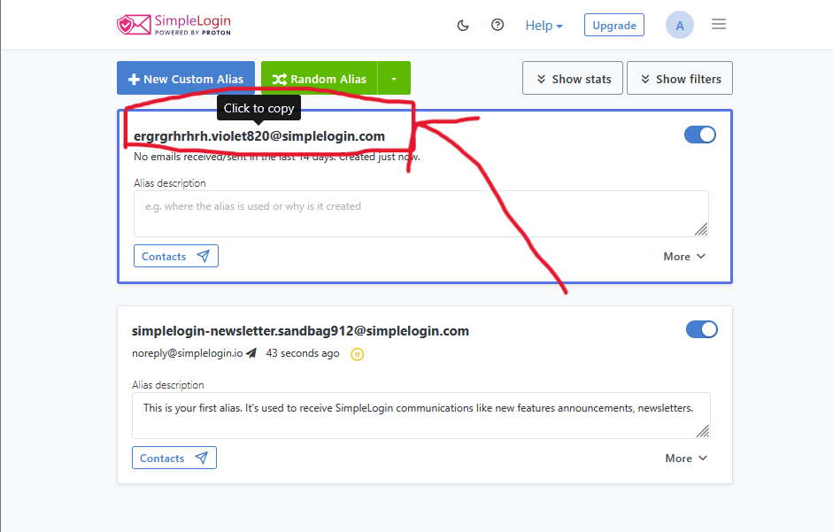
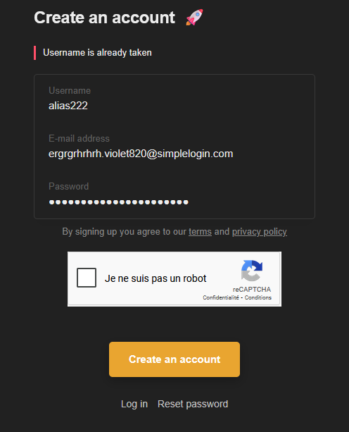
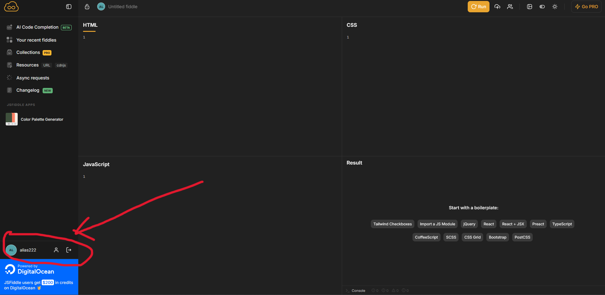

# Burner Emails – Temporary Email Addresses for Online Privacy

## 🕵️‍♂️ What Are Burner Emails?

Burner emails are **temporary email addresses** that self-destruct after a short time.  
They are used for one-time actions like signing up for a website or downloading a file,  
without exposing your **real email or identity**.

---

## 🎯 Why Use a Burner Email?

Every time you register somewhere with your real email:
- You risk **spam**
- You risk **data leaks**
- You risk being **tracked or profiled**

Burner emails protect you from all that.

---

## 📦 Popular Burner Email Services

| Service              | Lifetime        | Extra Features        |
|----------------------|------------------|------------------------|
| Temp-Mail.org        | 10–30 minutes    | Simple interface       |
| 10MinuteMail.com     | 10 minutes       | Auto-refresh inbox     |
| Guerrilla Mail       | Longer duration  | Persistent address     |
| AnonAddy             | Permanent aliases | Privacy-focused, encrypted |

---

## ⚙️ How Do They Work?

1. You visit the burner email website.
2. It gives you a random email address.

   
4. You use it to sign up for any service.

  
6. You receive the confirmation email.
7. After a while, the email inbox **disappears**.

✅ No spam  
✅ No identity leak  
✅ No tracking

---

## 🛠️ When Should You Use One?

- Registering on untrusted or shady websites
- Downloading free resources
- Testing an app or service
- Entering giveaways or surveys

---

## ⚠️ Limitations

❌ Don’t use them for:
- Important registrations (banking, recovery)
- Communication you want to keep long-term

Use tools like **AnonAddy** or **SimpleLogin** if you need a burner email with:
- Custom aliases
- Forwarding
- Inbox control

---

## 🔐 Why It Matters for Privacy

Burner emails:
- Break the link between your **email** and **your device**
- Avoid long-term **tracking or profiling**
- Stop spam from reaching your real inbox

They are a **simple but powerful tool** to stay anonymous and protect your identity.

---

> "Every email you give away is a trace.  
> Burn it before it burns your privacy."
