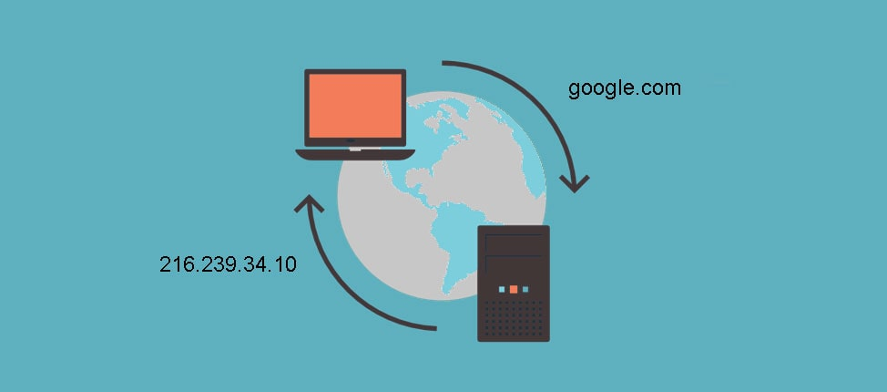
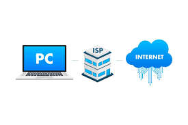
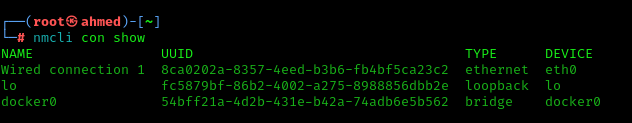
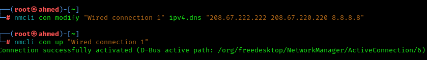
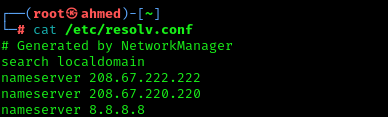

# 🌐 DNS and Privacy – Why You Must Change Your Default Resolver

## 📘 What is DNS?

**DNS (Domain Name System)** is the Internet’s “phone book.” It translates human-readable domain names like `google.com` into machine-friendly IP addresses like `142.250.185.206`.





Every time you visit a website, your system makes a DNS query. This happens before any HTTPS encryption is established, making it a critical part of your privacy posture.

---

## ❗ Why Changing Your Default DNS Matters

Most users rely on their **ISP’s default DNS servers** without realizing that:

- ✅ **All visited domains** are logged
- 🕵️ ISP can **track browsing habits**
- 🔀 DNS requests can be **redirected or hijacked**
- ❌ Even VPNs/Tor can leak if DNS isn’t configured properly

> If you’re located in Tunisia (or any country with monitored ISPs), using your ISP’s DNS server exposes your browsing activity—even when using privacy tools.



---

## 🧠 How DNS Can Leak Your Identity

| Scenario | Risk |
|----------|------|
| Using ISP DNS with Tor | DNS queries may go out **before** the traffic enters Tor |
| Using VPN but not changing DNS | ISP can still see which domains you're resolving |
| DNS not tunneled properly | Reveals metadata about browsing behavior |
| DNS Hijacking | ISP or attacker replaces real IPs with fake pages |

Even when you're using **Tor**, a misconfigured system can leak DNS queries to your ISP if DNS isn't forced through the Tor circuit.

---

## ✅ Recommended Privacy-Friendly DNS Providers

| Provider     | DNS Address(es)               | Notes                          |
|--------------|-------------------------------|--------------------------------|
| **Cloudflare** | `1.1.1.1`, `1.0.0.1`           | Fast and privacy-respecting    |
| **Quad9**      | `9.9.9.9`, `149.112.112.112`   | Blocks malicious domains       |
| **OpenDNS**    | `208.67.222.222`, `208.67.220.220` | More customizable filtering |
| **Google DNS** | `8.8.8.8`, `8.8.4.4`           | Reliable but not ideal for privacy |

---

## 🛠️ How to Change DNS (Linux + NetworkManager)

Check your active connection:

```bash
nmcli con show
```



Change DNS servers:

```bash
nmcli con modify "Wired connection 1" ipv4.dns "208.67.222.222 208.67.220.220 8.8.8.8"
```

Apply the new settings:

```bash
nmcli con up "Wired connection 1"
```



Verify:

```bash
cat /etc/resolv.conf
```



---

## 🔍 How to Test for DNS Leaks

Use online tools:

- [https://dnsleaktest.com](https://dnsleaktest.com)
- [https://browserleaks.com/dns](https://browserleaks.com/dns)

Or use command-line tools:

```bash
dig +short whoami.akamai.net @resolver1.opendns.com
```

---

## 🔐 How to Route DNS Over Tor (For Full Anonymity)

If you're using **Tor** and want to make sure DNS is isolated:

- Use `torsocks` for DNS queries:
  ```bash
  torsocks dig duckduckgo.com
  ```
- Use `oniux`, which isolates **all** traffic, including DNS
- Use Tails or Whonix, which automatically force all DNS through Tor

---

## 💡 Extra: Basic Shell Script to Detect DNS Leaks

```bash
#!/bin/bash
echo "[+] Checking for DNS Leak..."
curl -s https://www.dnsleaktest.com | grep -iE "ISP|country|location"
```

---

## 🚀 Summary

| Action | Purpose |
|--------|---------|
| Change DNS | Prevent ISP tracking and hijacking |
| Use privacy DNS providers | Reduce metadata exposure |
| Test for leaks | Verify your configuration |
| Use Tor-aware tools (e.g., oniux) | Route **everything** through Tor |
| Don’t trust default system settings | Always verify with tools |

---

## 🧷 Resources

- [https://dnsleaktest.com](https://dnsleaktest.com)
- [https://tails.net](https://tails.net)
- [https://www.cloudflare.com/learning/dns/what-is-dns](https://www.cloudflare.com/learning/dns/what-is-dns/)
- `man nmcli`

---

## 🧠 Final Thoughts

DNS is often the **weakest link** in your privacy chain. Changing your resolver is a simple yet powerful step to **make surveillance harder and anonymity stronger**—especially in countries where network monitoring is common.

Be in control of where your queries go. Your metadata matters.
