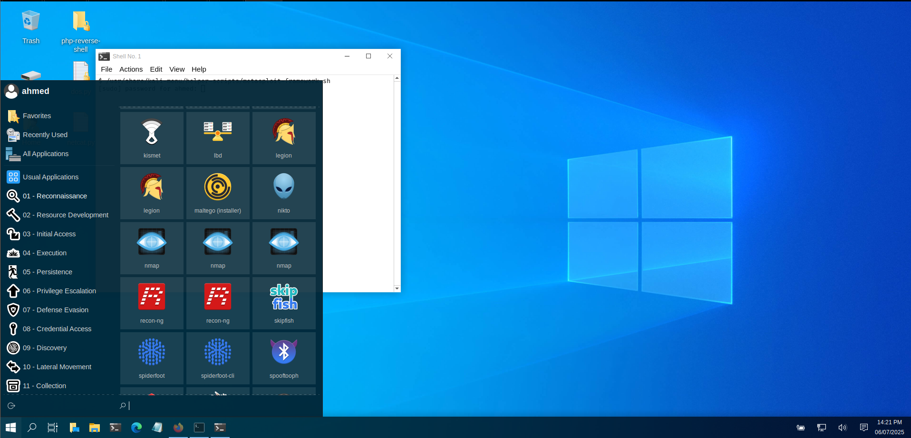

# 🕵️ Kali Undercover Mode – Documentation

## What is Kali Undercover Mode?

Kali Undercover Mode is a visual disguise feature in Kali Linux that makes your desktop look like Windows 10.  
It's designed to help users stay unnoticed while working in public spaces like cafes, schools, or offices.

Instead of using flashy hacker-style themes, this mode makes Kali appear like an ordinary Windows machine.

---

## Why Use It?

- 🛡️ To avoid attracting attention in public
- 💼 Useful when working around non-technical people
- 🎭 Helps keep your activities discreet without changing system functionality

Note: This is purely visual – it does **not** add or remove any system protections.

---

## How to Enable It?

Just open your terminal and run:

```bash
kali-undercover
```

This will switch your desktop environment to a Windows 10 lookalike.




To disable it and return to Kali’s original theme, run the command again:

```bash
kali-undercover
```

---

## Key Points

- ✅ It's included by default in Kali Linux
- ✅ No installation required
- ✅ Works instantly
- ❌ Doesn’t hide network activity or tools — just appearance

---

## Official Docs

You can read more on the official Kali page:  
🔗 https://www.kali.org/docs/introduction/kali-undercover/

---

## Summary

Kali Undercover Mode is a simple but powerful trick for remaining low-profile.  
It’s great for on-the-go professionals, students, or anyone who needs to blend in while still using Kali.

