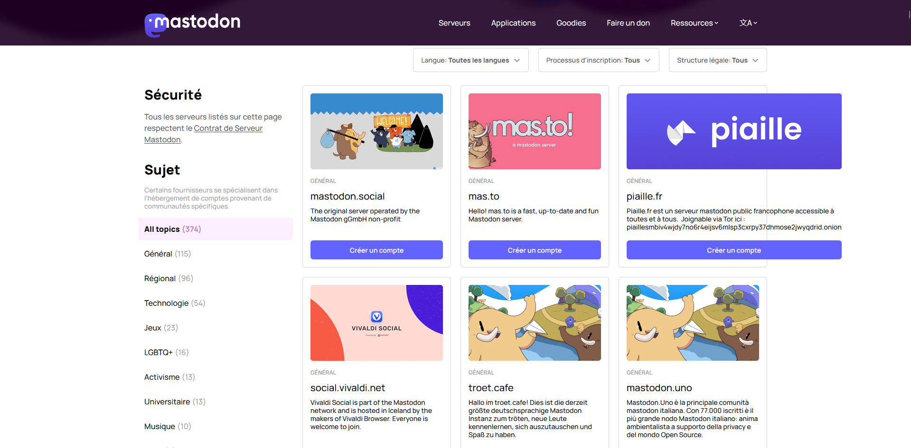
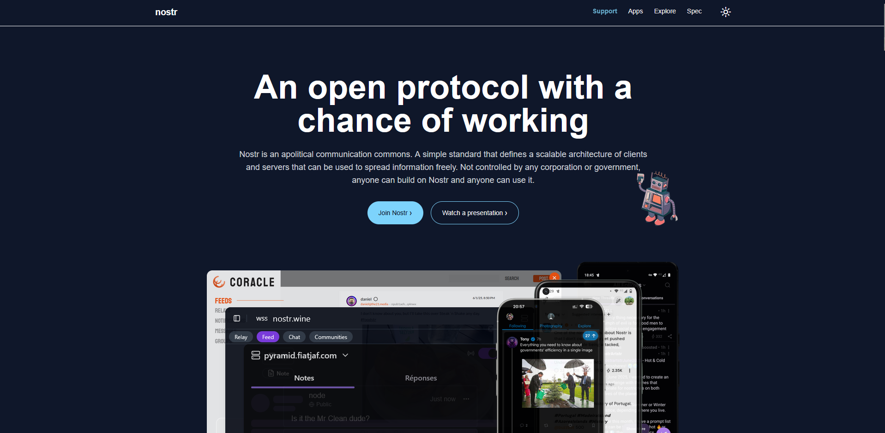

# Replace Twitter/X with Mastodon or Nostr – A Private & Decentralized Alternative

Tired of ads, censorship, and feeling watched on social media?

If you're looking for more control, privacy, and a real community-driven experience — **Mastodon** and **Nostr** are the new way to post, follow, and connect online.

---

## 🐦 What's Wrong with Twitter?

- Tracks everything you like, post, and read
- Owned by corporations – decisions are profit-driven
- Shadowbans, content takedowns, and moderation with bias
- Algorithmic timeline – you don’t control what you see

---

## 🐘 Mastodon – Social Media That Respects You

Mastodon looks and feels like Twitter, but it’s fully decentralized.

### ✅ Why Use Mastodon:
- No central company in control
- Thousands of independent communities (called "instances")
- No ads, no tracking, no algorithm
- You can join any server, or create your own
- Open-source and non-profit

### ⚠️ What to Know:
- You need to choose a server to join (like picking an email provider)
- Each instance has its own rules and moderation

> 💬 Perfect for people who want **freedom with a familiar experience**.

---

## 🕸️ Nostr – For True Anonymity and Free Speech

Nostr isn’t a platform – it’s a protocol for building social apps.

No usernames, no accounts. Just cryptographic keys and freedom.

### ✅ Why Use Nostr:
- Fully decentralized — no servers or accounts
- Works with “relays” that send/receive posts
- No email, no phone number needed
- No censorship or tracking
- Works over Tor

### ⚠️ What to Know:
- Interface depends on the app you use (like Damus or Amethyst)
- Smaller user base (but growing fast)

> 🕵️‍♂️ Best for users who want **complete control, privacy, and censorship resistance**.

---

## 💬 Quick Comparison

| Feature                   | Twitter/X     | Mastodon       | Nostr          |
|---------------------------|---------------|----------------|----------------|
| Centralized?              | ✅ Yes         | ❌ No           | ❌ No           |
| Ads / Tracking            | ✅ Yes         | ❌ No           | ❌ No           |
| Account Required          | ✅ Yes         | ✅ Yes          | ❌ No           |
| Easy to Use               | ✅ Yes         | ✅ Yes          | ⚠️ Medium       |
| Censorship Resistant      | ❌ No          | ⚠️ Depends      | ✅ Yes          |
| Anonymous Use             | ❌ No          | ⚠️ Possible     | ✅ Yes          |
| Runs on Tor               | ❌ No          | ✅ Yes          | ✅ Yes          |

---

## 🔄 Ready to Switch?

- Use **Mastodon** for day-to-day posting, following, and discussions — without surveillance.
- Use **Nostr** when you need **true freedom, no rules, and maximum privacy**.

You’re not the product anymore.

✅ Free your feed.  
🛡️ Take back your voice.
