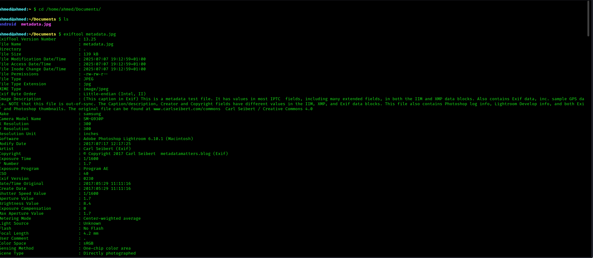
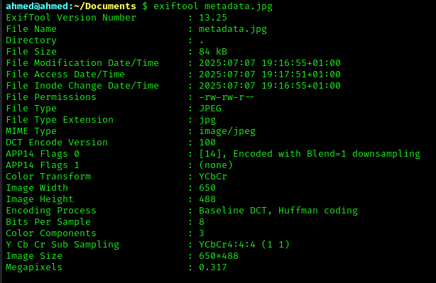

# Metadata Removal for Privacy

## What is Metadata?

**Metadata** is hidden data embedded in files like images, videos, PDFs, and documents.  
While you can't see it when opening the file normally, it can be extracted by tools or websites.

---

## What Can Metadata Reveal?

When you share a photo or document, metadata can reveal:
- GPS location of where it was taken
- Date and time of creation
- Device used (e.g., iPhone 13, Canon DSLR)
- Software used to edit the file
- Author's name or username
- Camera settings (flash, focus, resolution)

Even if your IP is hidden, metadata can still expose your identity.

---

## Why Is Removing Metadata Important?

Removing metadata is crucial when:
- You’re sharing sensitive images (e.g., whistleblowing, activism)
- You want to stay anonymous on forums or social media
- You're sending professional documents that shouldn't expose personal data
- You care about digital hygiene and privacy

---

## Tools for Removing Metadata

### ✅ MAT2 (Linux – Metadata Anonymization Toolkit v2)
A command-line tool for removing metadata from common file types.

**Install it:**
```bash
sudo apt install mat2
```

**Usage:**
```bash
mat2 myphoto.jpg
```

Creates a clean version of `myphoto.jpg` with all metadata stripped.

---

### ✅ ExifTool (Cross-platform)
A powerful tool to read/write/remove metadata.

**Install on Linux:**
```bash
sudo apt install libimage-exiftool-perl
```

**Remove metadata:**
```bash
exiftool -all= myphoto.jpg
```

Before:




After: 



> ⚠️ This command overwrites the original file. Use with caution.

---

### ✅ Python Method (Pillow + piexif)

**Install requirements:**
```bash
pip install pillow piexif
```

**Python script:**
```python
from PIL import Image
import piexif

image = Image.open("myphoto.jpg")
image.save("cleaned.jpg", exif=piexif.dump({}))
```

This creates a new image `cleaned.jpg` without metadata.

---

## How to Check for Metadata

Use ExifTool to inspect a file:

```bash
exiftool myphoto.jpg
```

If metadata is present, it will be displayed.  
To confirm removal, run the same command after cleaning. You should see “no EXIF data found.”

---

## Best Practices

- Always check images before sharing them publicly
- Scrub PDFs and office files too (MAT2 supports these!)
- Use privacy-respecting editing software
- Avoid uploading original files directly from phones or apps

---

## Conclusion

Metadata may look invisible, but it can reveal a lot about you.

Removing metadata is a simple but powerful step in protecting your identity online.  
If you care about privacy, clean your files before you share them.

**🔐 Stay sharp. Clean your data.**
