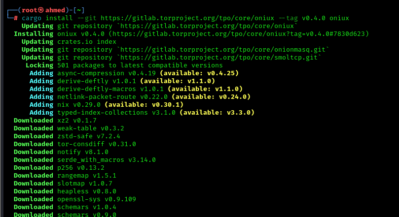

# 🧅 oniux – Tor Isolation for Any Linux Application

## 📘 What is oniux?

**oniux** is a powerful command-line utility that isolates any Linux application and forces it to use **Tor** for all its network traffic—**without relying on traditional SOCKS proxies**.

It uses **Linux namespaces** to ensure applications cannot accidentally leak traffic, providing high-level isolation for maximum anonymity.

---

## 🧪 Why oniux Exists

Routing everything through a SOCKS proxy (like with `torsocks`) is risky:

- ❌ Misconfigured apps can leak IPs
- ❌ Statically compiled binaries (e.g. from Zig) may bypass `torsocks`
- ❌ Malicious apps can ignore `LD_PRELOAD` hooks

**oniux fixes this** by using actual network isolation through the Linux kernel.

---

## 🔧 How Does it Work?

- Creates **network namespace** for the app
- Connects it to a custom interface: `onion0`
- All traffic goes through **onionmasq + Arti (Tor stack written in Rust)**
- Strips away capabilities
- Prevents **any connection outside of Tor**

> Result: no accidental leaks, even with misbehaving apps.

---

## 🔄 oniux vs. torsocks

| Feature | oniux | torsocks |
|---------|-------|----------|
| Tor Engine | Arti (Rust) | cTor (C) |
| Isolation Type | Linux namespaces | LD_PRELOAD trick |
| Leak Protection | ✅ Full | ❌ Apps can bypass |
| Static binaries | ✅ Supported | ❌ Not supported |
| Platform | Linux only | Cross-platform |
| Security | OS-level | App-level |

---

## 🚀 Installation

### Requirements

- Linux OS
- Rust toolchain

### Install

```bash
cargo install --git https://gitlab.torproject.org/tpo/core/oniux --tag v0.4.0 oniux
```


---

## 🧪 Example Usage

```bash
# Check your Tor IP
oniux curl https://icanhazip.com

# IPv6 support
oniux curl -6 https://ipv6.icanhazip.com

# Access a .onion site
oniux curl http://2gzyxa5ihm7nsggfxnu52rck2vv4rvmdlkiu3zzui5du4xyclen53wid.onion/

# Start a Tor-isolated shell
oniux bash

# Launch GUI apps under Tor
oniux hexchat
```

---

## ⚙️ Under the Hood

- Spawns a process using `clone(2)` with isolated namespaces
- Sets up `onion0` via onionmasq
- Mounts a Tor-friendly `resolv.conf`
- Drops all process capabilities after setup
- Forwards file descriptors via Unix sockets
- Launches the app inside isolated space

---

## ⚠️ Caveats

- New and experimental
- Linux-only
- Still not a replacement for full systems like Tails or Whonix
- Requires knowledge of how your system works

---

## 🧷 Resources

- [oniux GitLab](https://gitlab.torproject.org/tpo/core/oniux)
- [onionmasq](https://gitlab.torproject.org/tpo/core/onionmasq)
- [arti](https://gitlab.torproject.org/tpo/core/arti)

---

## ✅ Summary

**oniux** provides serious protection for advanced users who want to route any Linux application through Tor with confidence.

Use it when you can’t trust `torsocks`, and don’t want to run an entire Tails or Whonix system.  
It gives you the Tor power of Tails, with the flexibility of a custom Linux setup.
