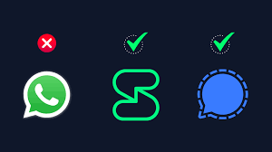

# Replace WhatsApp with Signal or Session – A Secure Messaging Alternative

Are you still using WhatsApp and wondering if there’s something safer?

Let’s be real: if your privacy matters, it’s time to switch.  
**Signal** and **Session** are two excellent tools that offer real alternatives — without spying, ads, or shady data practices.

---

## 🔍 Why Not WhatsApp?

Even with encryption, WhatsApp still:
- Belongs to **Meta (Facebook)** – a company known for collecting user data.
- Requires your **phone number** and access to your **contacts**.
- Collects **metadata** (who you talked to and when).
- Isn’t fully open-source.

If you care about who controls your information, it’s a red flag.  

---

## 📱 Signal – Familiar, but Private

Signal gives you the full WhatsApp experience — but without the spying.

### ✅ Why Use Signal:
- End-to-end encryption (Signal Protocol, used even by WhatsApp)
- Open-source and nonprofit
- Zero ads, zero tracking
- Works on all platforms (iOS, Android, Windows, Mac, Linux)
- Features: group chats, reactions, media sharing, voice/video calls

### ⚠️ Downside:
- Still needs a phone number to register (but doesn’t expose it)

> 👌 Best for people who want privacy without changing habits.

---

## 🕶️ Session – Anonymous by Default

Session is like Signal’s more secretive sibling. Built for **maximum anonymity**.

### ✅ Why Use Session:
- No phone number or email needed
- No central servers – it runs on the **Oxen** anonymous network
- Messages go through Tor-like routing
- Open-source and decentralized

### ⚠️ Downside:
- No voice/video calls (yet)
- Slightly slower delivery sometimes

> 🔐 Best for activists, journalists, or anyone needing real anonymity.

---

## 💬 Quick Comparison

| Feature                 | WhatsApp         | Signal            | Session           |
|-------------------------|------------------|-------------------|-------------------|
| End-to-end Encryption   | ✅ Yes            | ✅ Yes            | ✅ Yes            |
| Phone Number Required   | ✅ Yes            | ✅ Yes            | ❌ No             |
| Metadata Collected      | ❌ Yes            | ⚠️ Minimal        | ✅ None           |
| Voice/Video Calls       | ✅ Yes            | ✅ Yes            | ❌ Not yet        |
| Open Source             | ❌ Partially      | ✅ Fully           | ✅ Fully          |
| Anonymity               | ❌ Weak           | ⚠️ Limited        | ✅ Strong         |

---

## 🎯 Final Thoughts

- If you want **a smooth transition from WhatsApp** → use **Signal**
- If you want **true anonymity with no phone number** → use **Session**
- Both respect your privacy way more than WhatsApp ever will

---

## 🔄 Make the Switch

Privacy isn’t just a feature — it’s your right.  
Signal and Session are waiting. And they don’t spy.

📲 Download one. Invite your close circle.  
Start chatting safely.
