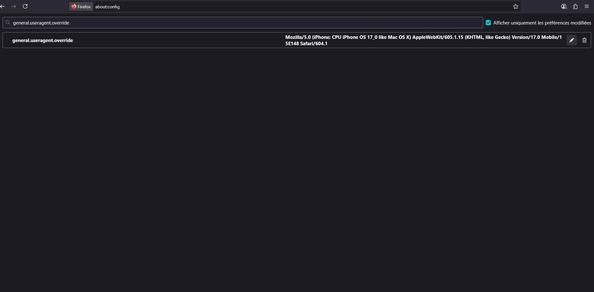
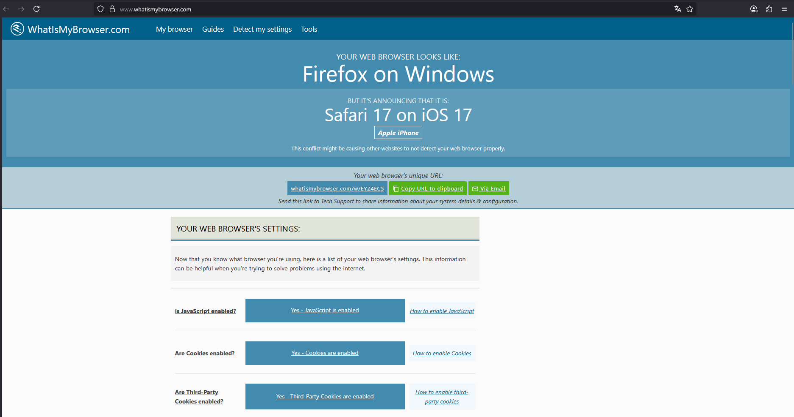
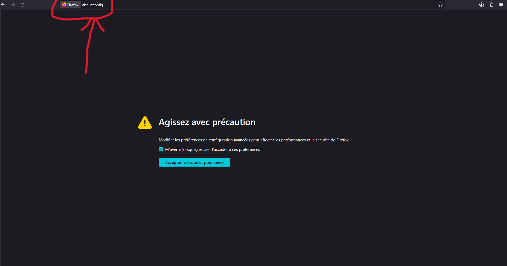

# Understanding User-Agent Strings and Their Role in Online Privacy

## What is a User-Agent?

A **User-Agent** is a string of text automatically sent by your browser or application when it connects to a website.  
It tells the server about your device, operating system, and browser details. For example:

```
Mozilla/5.0 (Windows NT 10.0; Win64; x64) AppleWebKit/537.36 (KHTML, like Gecko) Chrome/123.0.0.0 Safari/537.36
```

This line might not look dangerous, but it gives away a lot of information about you.

---

## What Does It Reveal?

Your User-Agent string can leak:

- **Operating System** (e.g., Windows, Linux, Android)
- **Browser type and version** (e.g., Chrome, Firefox, Safari)
- **Architecture** (32-bit or 64-bit)
- **Device type** (Mobile, Desktop, Tablet)
- **Browser engine** (like WebKit, Gecko)

This creates a **unique fingerprint** when combined with other elements like language, screen resolution, and fonts.

---

## Why Should You Care?

If you care about privacy, anonymity, or avoiding tracking, this matters.

Even with a **VPN or Tor**, your User-Agent could:

- Reveal unique system details
- Allow websites to **fingerprint** you
- Be used to **track or identify** you across sessions
- Influence how websites behave or render content

---

## Use Cases for Changing User-Agent

Changing your User-Agent can:

- Help **avoid fingerprinting**
- **Spoof** your device or OS (appear as a different user)
- Get **mobile versions** of websites on desktop (or vice versa)
- Test website compatibility during development
- Bypass certain blocks or restrictions

---

## How to Change User-Agent

### In Firefox:
1. Go to `about:config`


  
2. Search for: `general.useragent.override`

 

3. Create it as a new String and set your custom User-Agent



### In Chromium-based browsers:
Use an extension like:
- User-Agent Switcher for Chrome
- Modify headers manually via DevTools (F12 → Network tab)

### On Linux CLI (curl):
```bash
curl -A "CustomUserAgent" https://example.com
```

---

## Limitations & Considerations

- **Not foolproof**: Sites can still fingerprint you with JS and other data.
- **Too much spoofing** might break site functionality.
- **Some security tools** may flag spoofed User-Agents.

This is one layer in your privacy stack — not the full solution.

---

## Conclusion

The User-Agent may seem like a small piece of data,  
but it plays a big role in how you are tracked online.

🔒 To enhance your anonymity:
- Regularly change or spoof your User-Agent
- Combine it with other tools: VPNs, Tor, anti-fingerprinting extensions
- Disable JavaScript when possible

**Privacy is in the details — and the User-Agent is one of them.**
