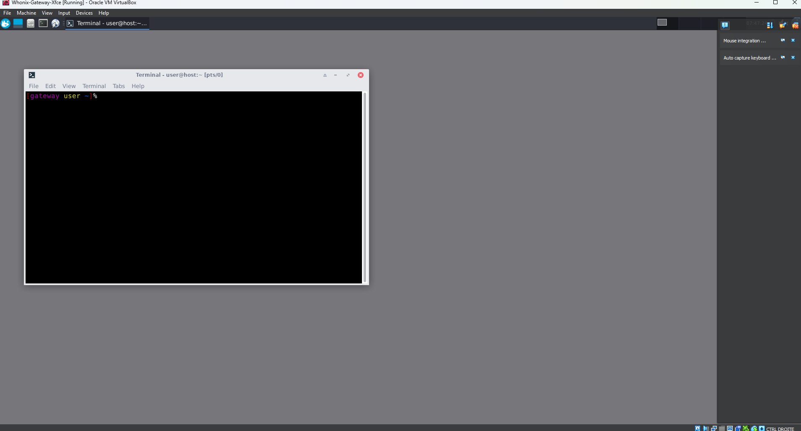
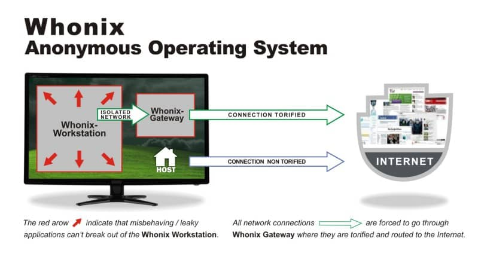

# Whonix: Anonymous Operating System Based on Tor

Whonix is a security-focused Linux distribution designed for advanced anonymity, privacy, and security. It routes all internet connections through the Tor network and uses strong isolation mechanisms to ensure that even if malware gains access to one part of the system, it cannot access your real IP.

## 🧱 Architecture: Gateway + Workstation

Whonix separates networking from user activity using two virtual machines:

- **Whonix-Gateway**: Connects to the Tor network and acts as a router.
- **Whonix-Workstation**: User-facing desktop that only connects to the internet through the Gateway.

This split ensures **network-level isolation**, one of Whonix’s core design principles.

## 🔐 Why It’s Safe

- **All traffic forced through Tor**: No accidental leaks.
- **Based on Debian**: Solid, well-maintained Linux base.
- **Stream isolation**: Apps use separate Tor circuits to reduce fingerprinting.
- **Preconfigured firewall rules**: Blocks non-Tor connections by default.

## ⚙️ How It Works

1. Gateway connects to Tor.
2. Workstation sends all internet traffic *only* through the Gateway.
3. Even if a browser or app is compromised, your IP stays hidden.

## 🧪 Use Cases

- Journalists, activists, and researchers in oppressive regimes
- Anyone who needs strong metadata protection
- Developers testing anonymous applications

## ⚠️ Limitations

- Not beginner-friendly: requires understanding of VMs and basic Linux.
- Slower speeds due to Tor routing.
- Time sync errors can block startup (use `systemcheck` and `sdwdate`).

## ✅ Installation Notes

Although Whonix offers `.ova` files for VirtualBox, you can convert them for **VMware** using tools like OVFtool or manual extraction.

Official OVA: [https://www.whonix.org/wiki/Download](https://www.whonix.org/wiki/Download)  
More info: [https://www.whonix.org/wiki/About](https://www.whonix.org/wiki/About)

---

*Whonix: Stay anonymous. Stay safe.*
